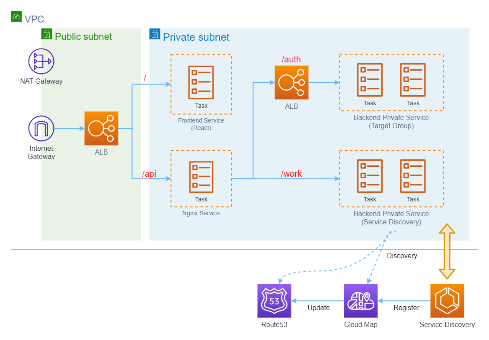

# AWS Fargate Microservice Architecture

## Architecture

## Demonstration Points

1. Container pull image through NAT Gateway
2. ECS service to service communication with internal load balancing
3. ECS service to service communication with service discovery + cloud map + route53
4. Use application load balancer for balancing
5. Use service discovery service for balancing
6. Application load balancer rule base routing
7. SSL Certificate attach to load balancer

## Infrastructure Services

| Service                   | Description                                                                                                                                                       |
| ------------------------- | ----------------------------------------------------------------------------------------------------------------------------------------------------------------- |
| VPC                       | A virtual network dedicated to your AWS account                                                                                                                   |
| NAT Gateway               | Enable instances in a private subnet to connect to the internet or other AWS services, but prevent the internet from initiating a connection with those instances |
| Internet Gateway          | A gateway that you attach to your VPC to enable communication between resources in your VPC and the internet                                                      |
| Public Subnet             |
| Private Subnet            |
| ECR                       | A fully managed container registry that makes it easy to store, manage, share, and deploy your container images and artifacts anywhere                            |
| ECS Cluster               | A logical grouping of tasks or services                                                                                                                           |
| ECS Task Definition       | Required to run Docker containers in Amazon ECS                                                                                                                   |
| ECS Service               | Enables you to run and maintain a specified number of instances of a task definition simultaneously in an Amazon ECS cluster                                      |
| ECS Service Task          |
| Application Load Balancer | Distributes incoming application traffic across multiple targets, such as EC2 instances, in multiple Availability Zones                                           |
| Target Group              | Used to route requests to one or more registered targets                                                                                                          |
| Cloud Map                 | Cloud resource discovery service                                                                                                                                  |

|Amazon Route 53 |Highly available and scalable cloud Domain Name System (DNS) web service

## Terraform Graph

